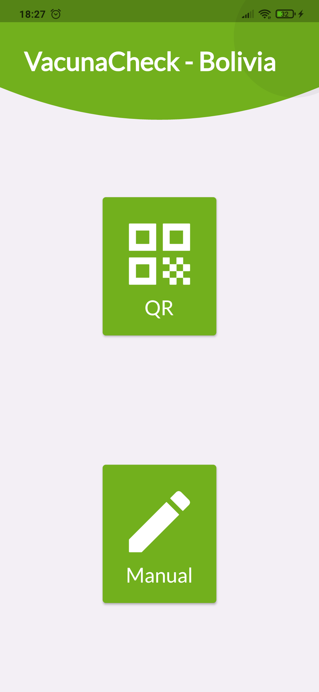
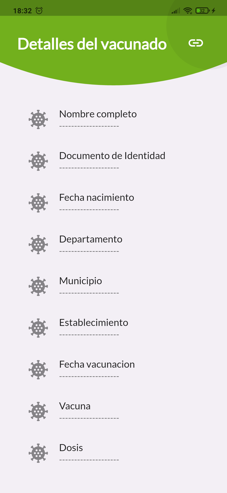
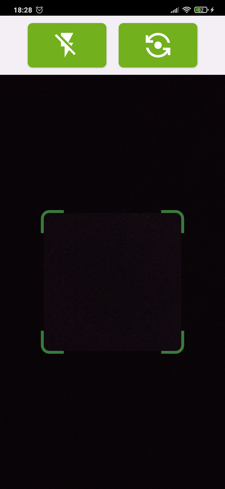
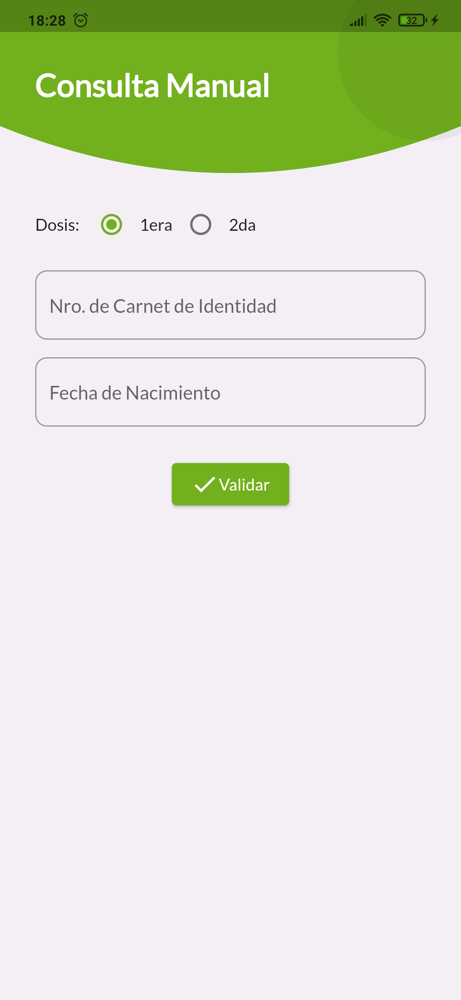

# VacunaCheck - Bolivia
Esta aplicación permite validar los datos de un carnet de vacunación escaneando el QR de una manera fácil y sencilla, consultando directamente al sitio del Ministerio de Salud sin necesidad de descargar manualmente los carnet de vacunación.

**Capturas de pantalla:**

|  |  |
|-------------------------------------|---|
|  |  |

**Descarga:**
Para descargar la aplicación visita la [sección de releases](https://github.com/CesarSP99/vacunacheck-bo/releases/latest) y sigue las instrucciones. Es probable que tengas que habilitar la instalación de orígenes desconocidos

**Notas importantes:**
- La aplicación no almacena ningún dato o información personal.
- La aplicación no usa sitios intermediarios, toda la información es rescatada directamente del sitio del Ministerio.
- Las solicitud son cifradas usando HTTPS
- Ni la aplicación, ni mi persona tiene representación asociación o con el Gobierno y/o Ministerio
- Se recomienda instalar la aplicación únicamente de este repositorio para evitar modificaciones de terceros.
- Todo el código fuente de la aplicación se encuentra en este repositorio, por lo tanto, cualquiera puede revisarlo.

---

### © CesarSP - Todos los derechos reservados
